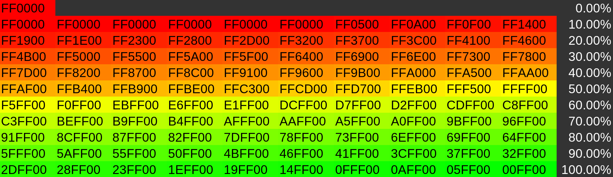

# Razer Battery Monitor
Script for setting Razer peripheral LED's to represent the current battery percentage on Linux. I have only tested this on Pop!_OS 21.04

## What/Why
New linux user (be kind, its my first bash script), I couldnt find any good method for monitoring my Razer Basilsk Ultimate mouse's battery percentage. This script uses the amazing openrazer-daemon with polychromatic front end to retrieve the device data, and update the LED's. I believe polychromatic has this feature on their roadmap, but until then this will satisfy my needs.

I set-up crontab to schedule this script every minute, but every 2-5 minutes is probably more reasonable.

The lookup table hex values corresponds each element with a colour, which represents the battery charge as shown in the table below.

## Default Behaviour
I Have set the default behavior as follows, easily adjustable to whatever you want.

Charging       - Brightness 100%   Dual colour breathing between % colour and %+10 colour.
Full Charge    - Brightness 100%   Static Green
Normal use     - Brightness 50%    Static colour of battery %
Low battery    - Brightness 5%     Dual colour breathing between maroon/purple

When fully charged but still docked, the colour stops 'breathing' and becomes static.

The low battery uses weird colours just to distinguish between low battery in use, and low battery charging. Ideally I would have liked intermitint fast flashes or similar but i dont believe thats possible with the current API.

## Setup
Once again lots of gratitude to all those involved in the below projects!

Openrazer is required, follow their installation instructions: https://openrazer.github.io/#download

The polychromatic API is used for setting the LED colours: https://polychromatic.app/

Set script as executable `chmod +x <path_to_script>/razercharge.sh`

Ensure script works in terminal. To adjust the behavior/colour/brightness of what happens when charging or low battery, simply adjust the values in the if/else tree.

## Scheduling
 Add `*/X * * * * <path_to_script>/razercharge.sh` to crontab (change `X` to the delay in minutes between LED updates). For further instructions see: https://linuxhandbook.com/crontab/

## Troubleshooting
After working perfectly in the terminal I had lots of issues getting it to schedule correctly in cron. I believe (still noob), that the cron environments do not point to the same environment variables as the terminal does natively so need to be manually defined at the top of the script. These are presently commented out for running in terminal only. I had to update $PATH, $SHELL, $DBUS_SESSION_BUS_ADDRESS, and $XAUTHORITY. Several threads online mentioned defining $DISPLAY as well solved their errors.

The values were grabbed straight from terminal with `echo $PATH`, `echo $SHELL`, while the DBUS and Xauthority are updated from the system files.

Alternatively these variables may be added to the top of the crontab file instead of the script, both methods work.

Without defining the DBUS and Xauthority in particular I was getting the error "Unable to autolaunch a dbus-daemon without a $DISPLAY for X11" when trying to execute the python3 line to poll the razer DeviceManager().